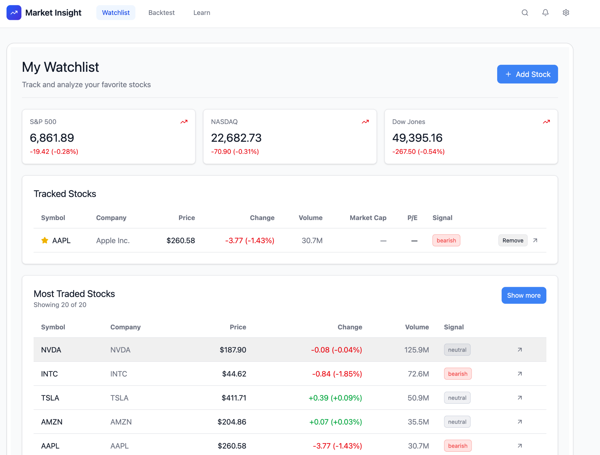
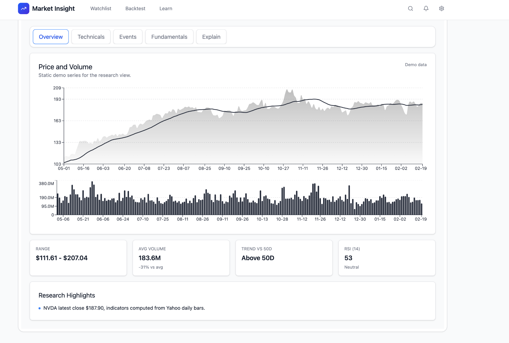
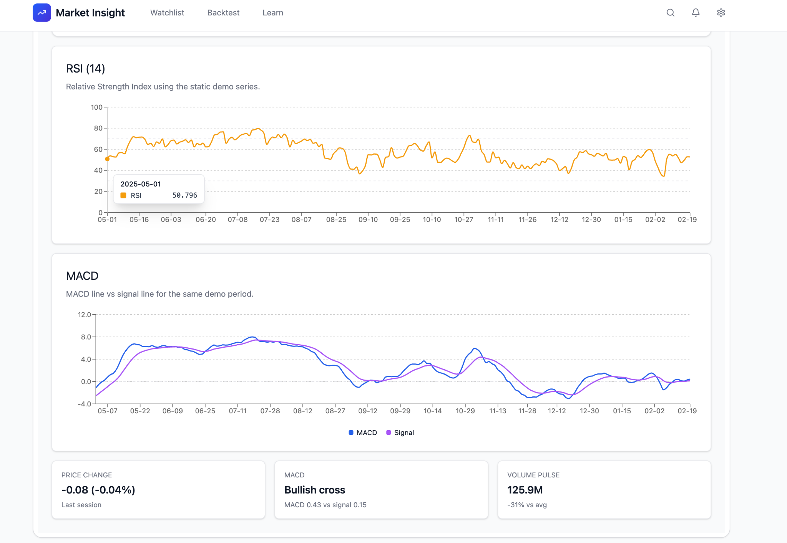
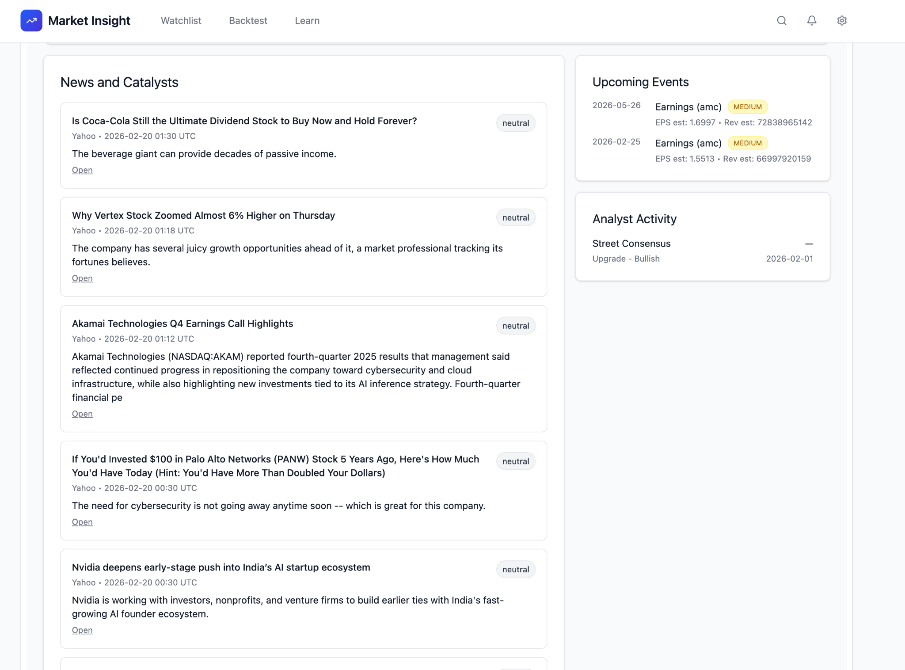
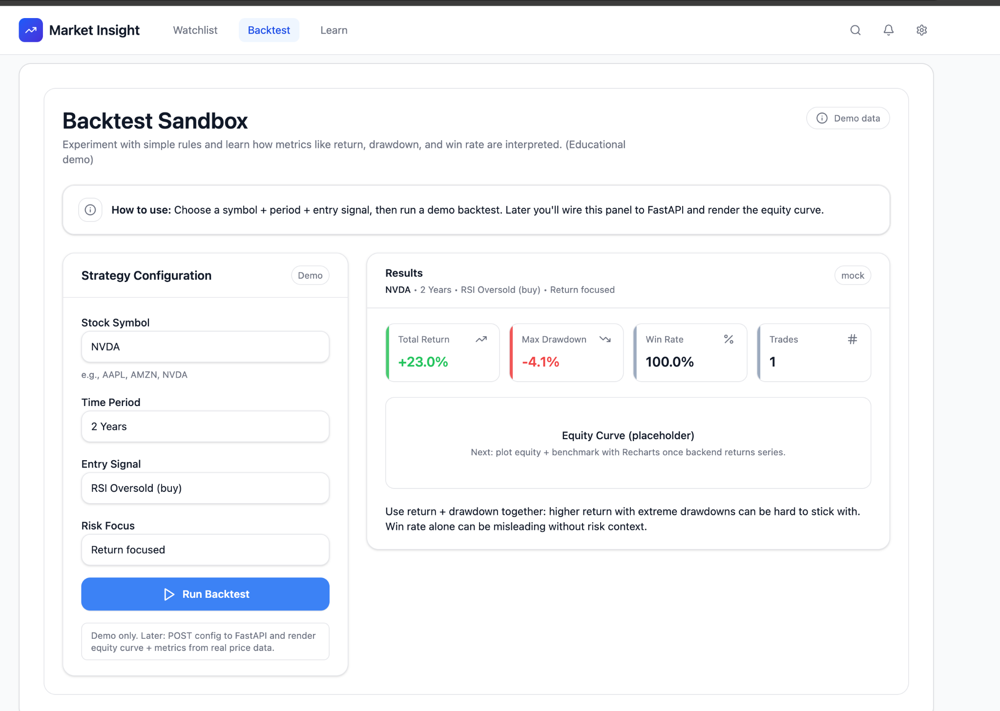
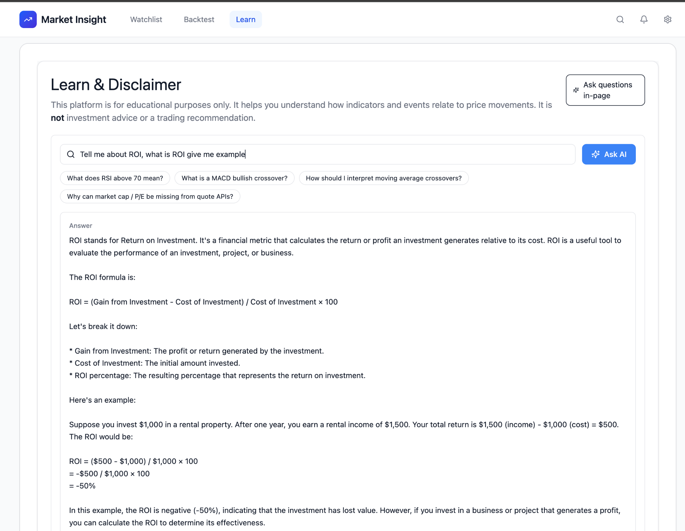

# Stock Market Monitoring System

Full-stack web application for retail investors: monitor stocks, view technical indicators, run backtests, read market news, and learn finance concepts with an AI tutor. Built as a BSc Computer Science project (University of Hertfordshire, 6COM2018).

## Demo

### Watchlist

Track indices, personal watchlists, and most-traded stocks with live-style quotes and sentiment signals.



### Stock details — overview

Price and volume charts with key metrics (range, volume, trend vs 50D, RSI).



### Stock details — technicals

RSI (14) and MACD charts with summary cards for momentum and volume.



### Events

News and catalysts with sentiment tags, upcoming earnings, and analyst activity.



### Backtest sandbox

Configure symbol, period, entry signal, and risk focus; view return, drawdown, win rate, and trade count.



### Learn — AI tutor

Ask finance questions and receive structured educational answers (not investment advice).



## Repository structure

```
StockMarketMonitoringSystem/
├── README.md
├── docs/screenshots/         ← UI demo images
├── Wealth Management App/    ← React + Vite + TypeScript frontend
└── WealthBackend/            ← FastAPI + Python backend
```

## Features

| Area | Description |
|------|-------------|
| **Watchlist** | Track symbols with price, change, volume, market cap, P/E |
| **Stock details** | Price/volume charts, SMA (20/50), ROI, RSI, MACD |
| **Events** | News, earnings, analyst activity (Finnhub) with sentiment labels |
| **Backtest** | Strategy simulation via backtrader (period & risk options) |
| **Learn** | Educational Q&A via Meta-Llama-3-8B-Instruct (Hugging Face Router) |

> **Disclaimer:** This system is for education and research only. It does not provide investment advice.

## Tech stack

| Layer | Technologies |
|-------|----------------|
| Frontend | React 18, Vite, TypeScript, Tailwind CSS, Recharts |
| Backend | FastAPI, pandas, numpy, yfinance, backtrader, finnhub-python |
| AI | Hugging Face Router + Llama 3 (Learn page) |

API keys are stored in backend environment variables only—not in the browser.

## Prerequisites

- **Node.js** 18+
- **Python** 3.10+
- API keys: [Finnhub](https://finnhub.io/), [Hugging Face](https://huggingface.co/) (for Learn page)

## Quick start

### 1. Backend

```bash
cd WealthBackend
python -m venv .venv
source .venv/bin/activate          # Windows: .venv\Scripts\activate
pip install -r requirements.txt
cp .env.example .env               # add FINNHUB_API_KEY and HF_TOKEN
uvicorn app.main:app --reload      # http://localhost:8000
```

### 2. Frontend (new terminal)

```bash
cd "Wealth Management App"
npm install
cp .env.example .env               # optional; most calls use the backend
npm run dev                        # http://localhost:3000
```

Open **http://localhost:3000**. The Vite dev server proxies `/market` and `/backtest` to the backend on port 8000.

## Environment variables

### `WealthBackend/.env`

| Variable | Purpose |
|----------|---------|
| `FINNHUB_API_KEY` | News and market events |
| `HF_TOKEN` | Hugging Face Router (AI tutor) |

### `Wealth Management App/.env` (optional)

| Variable | Purpose |
|----------|---------|
| `VITE_API_BASE` | Leave empty to use Vite proxy in development |
| `VITE_ALPHA_VANTAGE_API_KEY` | Only if calling Alpha Vantage from the client (not recommended) |

Never commit `.env` files. Use `.env.example` as a template.

## Main API endpoints

| Method | Path | Description |
|--------|------|-------------|
| GET | `/market/most-traded` | High-volume stocks |
| GET | `/market/daily` | OHLC history for a symbol |
| GET | `/market/research` | SMA, RSI, MACD, ROI |
| GET | `/market/events` | News and calendar data |
| POST | `/backtest` | Run a backtest strategy |
| POST | `/api/ask` | AI educational Q&A |

Interactive docs: **http://localhost:8000/docs**

## Roadmap

- Production deployment (frontend + backend)
- Dedicated **AI agent** for guided stock research workflows
- **Stock prediction model** (e.g. LSTM / hybrid) exposed via the backend for research signals only
